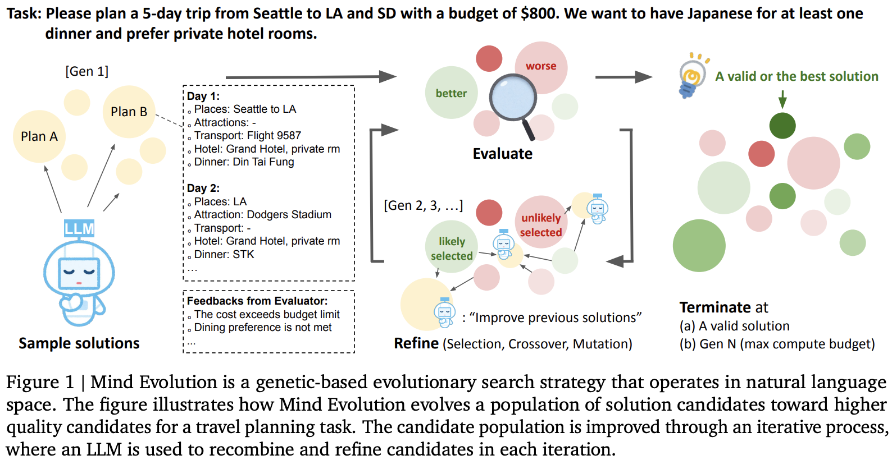

</img>

## Mind Evolution - Pytorch (wip)

Implementation of Mind Evolution, [Evolving Deeper LLM Thinking](https://arxiv.org/abs/2501.09891), from Deepmind, in Pytorch

## Citations

```bibtex
@inproceedings{Lee2025EvolvingDL,
    title   = {Evolving Deeper LLM Thinking},
    author  = {Kuang-Huei Lee and Ian Fischer and Yueh-Hua Wu and David Marwood and Shumeet Baluja and Dale Schuurmans and Xinyun Chen},
    year    = {2025},
    url     = {https://api.semanticscholar.org/CorpusID:275606406}
}
```
